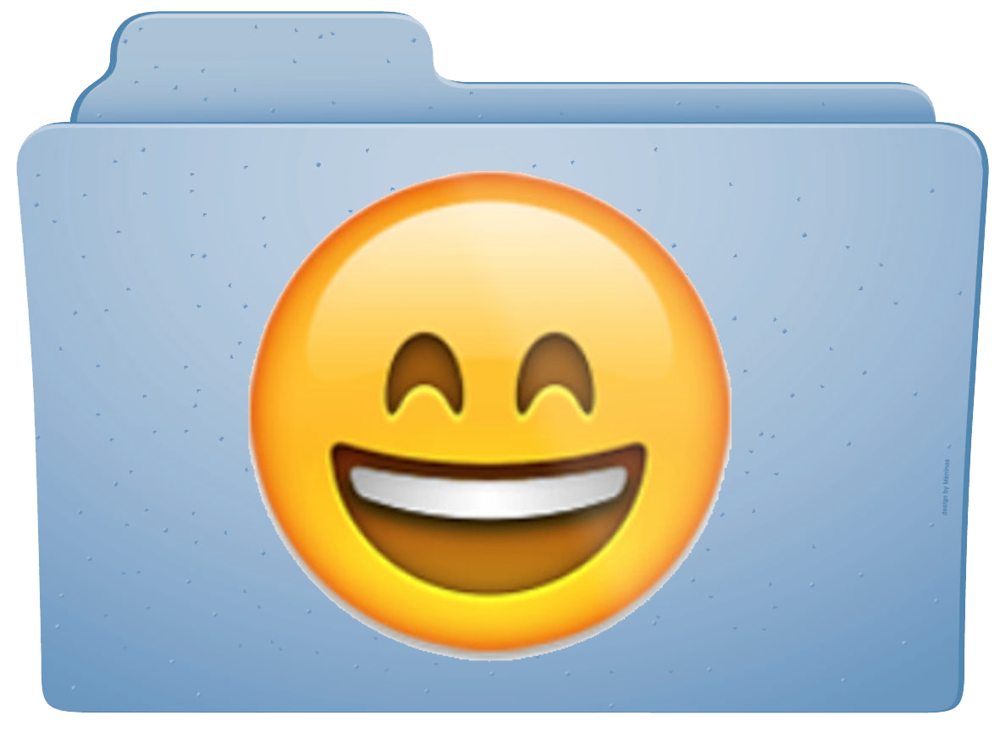
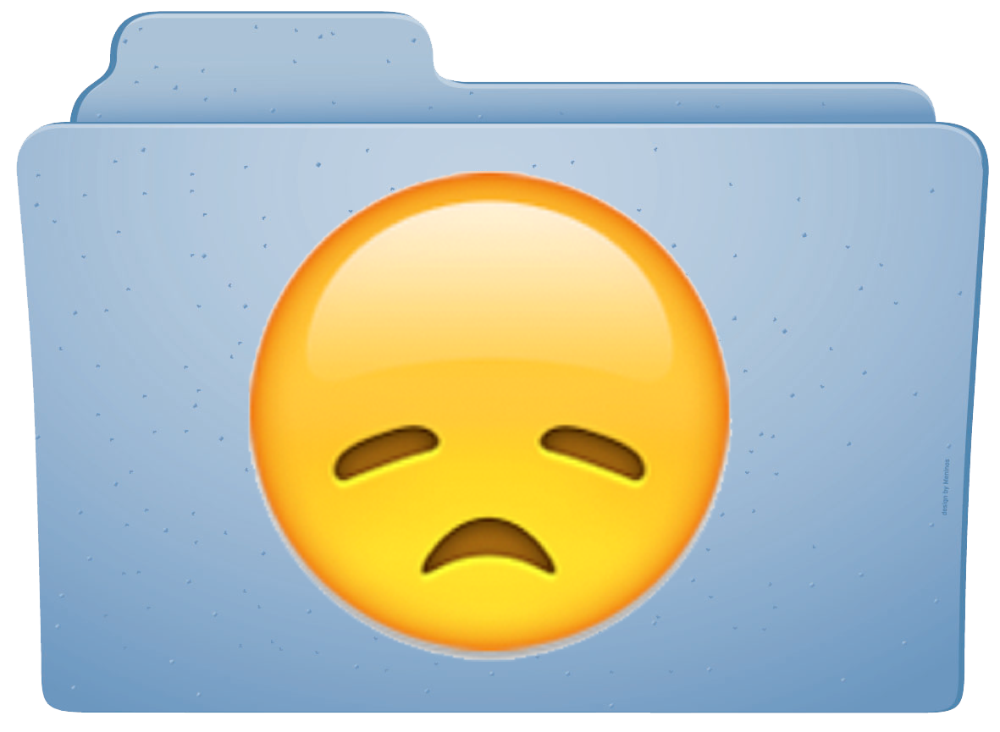
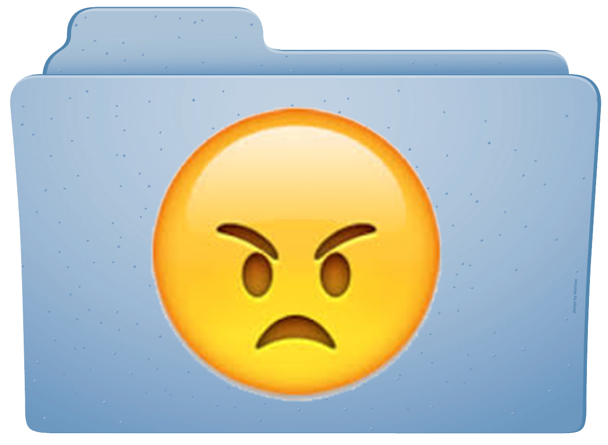
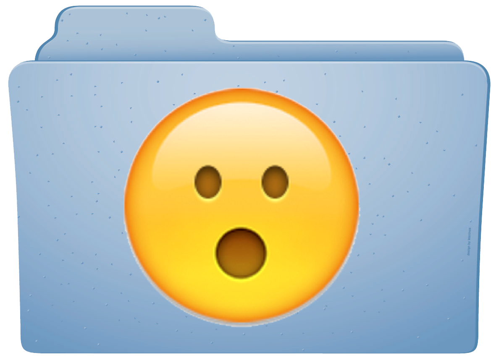

</img>
</img>
</img>
</img>

# Emotions Folder

The Emotions Folder is an OS X application that uses your webcam to continuously monitor your facial expression. When it recognizes any display of emotion (happiness, sadness, anger, or surprise), it stores a snapshot of your face alongside with what’s on your screen inside a folder named “Emotions” on your home directory.

The Emotions Folder is meant to be companion in self-reflection, allowing you to inspect your emotional past anytime you want and answer questions such as “what kind of stuff tends to make me sad?” or “what day of the week do I feel angry the most?” 

If you're in a confessional mood, you now get to quickly share your recent emotions with your friends or on social media by dragging + dropping snapshots from your Emotions Folder. And if you ever want a clean break from the past, you can throw the Emotions Folder in the Trash Can. (Don't worry, the Emotions Folder will be regenerated when you start feeling things again.)

The Emotions Folder constructs a digital trail of your emotional past, proving that you're not just someone who consumes and produces content, but someone who _feels_ things while doing so.  It’s a first step towards a new kind of software that doesn’t treat you as a one-dimensional, utilitarian user but as a complex, sentimental human being!
